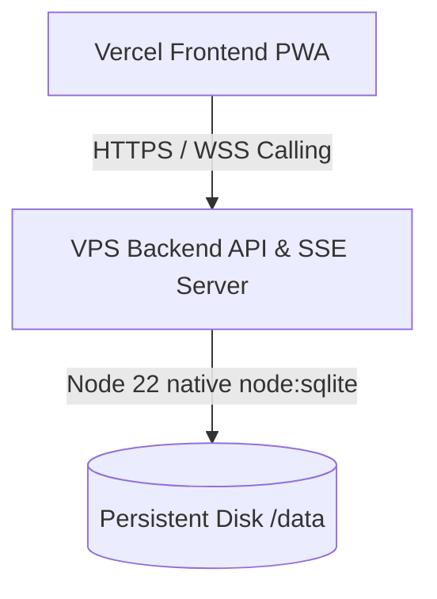

# crookshanks Production Deployment Guide

This guide details the steps to deploy the zero-dependency, self-hosted chat and WebRTC calling app **crookshanks** into production.

---

## Architecture Overview

---

## 1. Frontend Deployment (Vercel)

Vercel is optimized for building and serving Vite single-page applications.

### Setup Checklist
1. **Import Project**: Connect your GitHub repository to Vercel and select the `crookshanks` project.
2. **Configure Directory**: Set the **Root Directory** to `frontend`.
3. **Build Settings**:
   - **Framework Preset**: `Vite` (detected automatically)
   - **Build Command**: `npm run build`
   - **Output Directory**: `dist`
4. **Environment Variables**:
   - Add `VITE_API_BASE_URL` with the URL of your deployed backend (e.g., `https://crookshanks-api.onrender.com`).
5. **SPA Routing**: The `vercel.json` routing configuration is already placed in `./frontend/vercel.json` to handle all page reloads cleanly.
6. **Click Deploy**.

---

## 2. Backend Deployment (Render / Railway / Fly.io)

The backend maintains active SSE connections and an SQLite database on disk. A VPS provider supporting persistent storage and Docker containers is required.

### Dockerfile Deployment
The `./backend/Dockerfile` is pre-configured to build on a lightweight Node 22 Alpine base, automatically run `node init-db.js` for migrations, and launch the server.

### Setup Checklist
1. **Create Web Service**: Choose "Deploy from Git Repository" and specify the `./backend` subfolder as the root, or deploy via the Dockerfile option.
2. **Persistent Disk Mount**:
   - Attach a persistent volume (Render Disk / Railway Volume).
   - **Mount Path**: `/data`
   - **Size**: 1 GB is more than enough for SQLite and media files.
3. **Environment Variables**:
   - `DATABASE_PATH`: Set to `/data/database.sqlite` (points SQLite to the persistent disk).
   - `JWT_SECRET`: Generate a secure, long random string.
   - `PORT`: Set to `5000` (Render/Railway injects this automatically).
4. **Deploy Service**: The build pipeline will automatically verify database tables, create indexes, apply schema additions, and start listening for connections.

---

## Production Security Notes

> [!WARNING]
> Since WebRTC calling utilizes browser media capture APIs (`getUserMedia`), browsers **restrict access** to camera and microphone on non-secure connections. To use video and voice calling, your frontend Vercel URL and backend API server **must use HTTPS**. Both Vercel and Render handle SSL certificate provision automatically.
